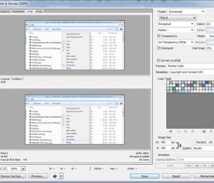
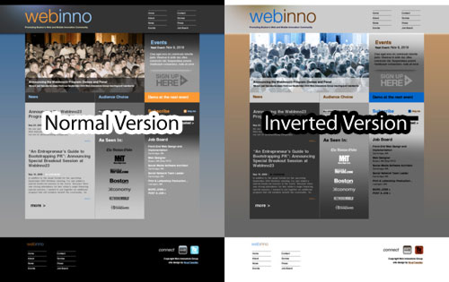
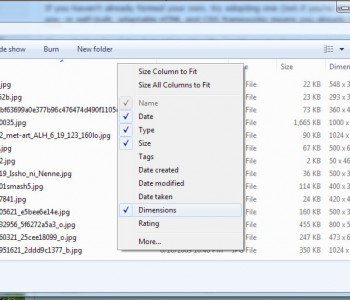
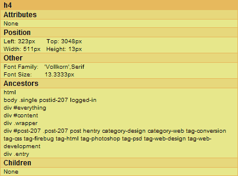
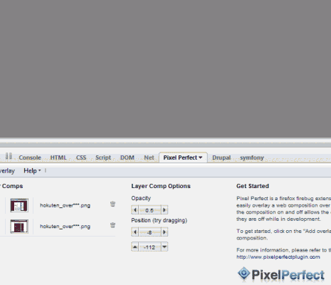

Ever wonder how those PSD to HTML services do the job with such a quick
turnaround, sometimes guaranteeing valid code in 24 hours on even the most
complex PSDs? The task is roughly 40% breaking up the PSD logically, 20% coding,
and 40% moving elements around until everything fits together. Here are some
tips I’ve learned from years of experience and trying to find new techniques in
those tutorials the web has too many of.

### Photoshop Techniques

I usually start a conversion by preparing the assets. Working with the design
first (as opposed to starting with the framework) also gives me a better sense
of where everything goes.

#### Save for Web

Alt+Ctrl+Shift+S, or on Macs, Cmd+Opt+Shift+S. This is the key combination
you’ll use to save every piece of the PSD you’re going to use for your design.
From the Save for Web window, you can choose the best filetype for the image
you’re saving based on quality and size.

#### Convert to Smart Object

For groups of layers (including text) that doesn’t use layer blending options
and aren’t affected by adjustment layers, select the layers and/or groups
involved and convert them to a Smart Object. A Smart Object is a temporary
vector object that you can modify as a separate file (a PSB file). The
modifications will appear in the original PSD. Double click on the smart object
in the layers menu to edit it as if it were a new image. From the Smart Object
edit window, you can Save for Web.

#### Selecting Layers

Ctrl+Click on the layer thumbnail to select the contents of the layer. This
beats using the wand tool or something to select the transparent pixels around
it. You can also do Ctrl-shift and Ctrl-Alt clicks on additional layer
thumbnails to add and subtract them from the selection.

#### Copy merged

A godsend of a shortcut. Ctrl+(Macs: Command)+Shift+C. I use this for layers
that have blending options set or are affected by adjustment layers. After
you’ve copied it, do a Ctrl+(Macs: Command)+N and paste to the new file. Then
Save for Web.

#### Slicing’s other use

I feel that slicing is an outdated method to chop up a PSD because complex
designs will use overlays of all kinds. Slicing has other uses, though.
Sometimes I’ll slice the document and have Photoshop generate HTML for me.
I then open the generated document in Firefox and use Firebug to get the
computed sizes for block elements later on.

#### Actions

Actions are so underused! These are macros that you can create simply by
recording what you do. You can create an action that does any of the things I’ve
listed above for you. For instance, next time you make a selection, start
recording an action as you Copy Merged -> Create a New File -> Paste -> Save for
Web. Stop recording and save your action (you might have to delete the steps
after the Save for Web dialog appears). Next time you make a selection that
needs to be Copy Merged and saved into a new file, just run the action and save
as a new name! Here is a more in-depth [tutorial on creating Photoshop
Actions](http://morris-photographics.com/photoshop/tutorials/actions.html).

#### Text

Take note of the font-face and font-sizes in pixels used before you dive into
the HTML. It’s okay to use pixel font sizes these days, but if you’re old-school
like I am at least you can find the relative size now that you have them all.

#### Flattened Versions

Save a flattened version of the site. Print it out if you want. This will be
useful for reference by eye, and for working with the Pixel Perfect Firebug
extension. Finally, invert the colors of a flattened version and save it as
a new file. You’ll also want this for Pixel Perfect.

### Creating the HTML and CSS

This part should be simple—it just involves creating the `
`, ``,
headers, and paragraphs you need. If you took note of the font information like
I told you to above, now is a good time to define it in your CSS. Besides
putting a body background color/image in, the font stack really helps everything
look like it’s nearing completion.

#### Frameworks and Resets

If you haven’t already formed your own, try adopting the popular ones (not if
you’re on a deadline, though). Fluency with pre- or self-built, HTML and CSS
frameworks means you already have the groundwork complete and only need to add
more block elements as needed. You shouldn’t waste any time finding a reset or
creating the same `
` you do for every layout.

#### Quickly get Image Dimensions

For Windows users, in Explorer you can add a Dimensions column to the detail
view. Right click on the column names and Dimensions should be one of the
options available.

### Design in Firefox

The number of development tools in Firefox makes it the single, indisputably
best browser for web development. This is not to say it is the best at
rendering, or fastest browser (both of which are Opera 10.5 beta at the time of
this writing), but it is close enough and will make your job easier.

#### HTML Validator

If you’re on a PC this instant validation cue on the bottom right of the browser
is incredibly helpful. Just make sure it’s always green. Double click it to see
the errors if it isn’t. If you’re on a Mac, you can use the shortcut provided in
the Web Developer extension for quick validation.

#### Web Developer

The designer and framework you’re using and should have covered most things this
extension would be used to debug, but there are a few things left that it can
help with.

One thing I do is test visited link status by going to Miscellaneous -> Visited
Links to test the style of visited links.
I also do a Forms -> Populate Form Fields to test form field fonts.

Again, you can access a quick shortcut to HTML validation with this extension.
Use it for both regular and generated source validation. Validate your CSS as
well!

Finally, Ctrl+(Macs: Command)+Shift+F will is a quick and lightweight
alternative to Firebug for finding out computed styles. Just hover over your
element. Press the keys again to finish.

#### Computed Sizes with Firebug

As I mentioned before in the Photoshop Slicing section, sometimes I’ll slice
the document and have Photoshop generate HTML for me. I then open the generated
document in Firefox and use [Firebug](http://getfirebug.com/) to get the
computed sizes for block level elements.

#### In Place CSS Editing with Firebug and the Arrow Keys

One of the best things about Firebug is the ability to edit CSS in place. From
either the HTML or CSS tab, you can add and edit rules and properties by
clicking on them. If you put the cursor on a numeric property you can use the up
and down arrow keys to increment and decrement the value (tip: use Shift+Arrow
to increment by 10). In this way, you can move and resize block elements and
change margins and paddings. Don’t forget to copy the final value into your CSS
document.

#### Pixel Perfect and Inverted Overlays

Firebug is much more useful with Pixel Perfect. This extension lets you place
elements on the browser screen and adjust their position and opacity. Drag the
overlaid image to reposition it. Use the panel to hide or adjust opacity.
I usually add a flattened version of the design and an inverted color flattened
version. With the inverted version, set the opacity to 0.5\. If your block level
elements are in the correct place, the screen should turn gray. Anything that
doesn’t match up to the PSD exactly will be in color (this works similar to the
Photoshop “Difference” blending mode). You can use this with the Firebug
technique described earlier to quickly get everything in the exact pixel
location.

Here’s an example of the inverted overlay on top of this post, one pixel off:

And here is the same overlay when the elements are in the exact positions (I
shifted the overlay, but for designing you should shift the elements):

Using Firefox and Firebug to do your design, you’re just moving blocks around
with the arrow keys. It’s WYSIWYG editing without the pitfalls!

### Closing

I’m not a fan of those rapid PSD to HTML shops only because I am wary of the
quality of work they produce. I’m sure there are a few good ones, but I still
prefer to do it myself. If you’ve got any tips or tricks of your own, leave me
a comment!

### References

1. [Firebug](http://getfirebug.com/)
1. Pixel Perfect Firefox Extension
1. [Using Actions to Automate Tasks in Photoshop](http://morris-photographics.com/photoshop/tutorials/actions.html)

