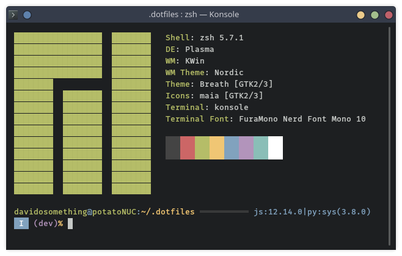

## Physical setup

My desk is a 48"x24" [Herman Miller Everywhere Rectangular Table]. I really
wish I had gone with the white finish and legs for the table.

There is a giant [AUKEY mouse pad] on top for unlimited mouse travel, and it's
much nicer to have a soft surface than to place my wrists on the bare desktop.

I sit on a comfy padded dining chair and I have no issue with it. It looks
better than an office chair since my setup is in the living room.

I have a nice [Poppin file cabinet] that doubles as a second seat.

My old Mac Pro 5,1 serves as a foot rest at the moment.

## Hardware

My primary computer is the [Intel NUC 7i5BNH].

<strong>How I ended up on a NUC (click to expand)</strong>

I was using a 2010 Mac Pro 5,1 that I bought off an office liquidation
auction in 2016. Apple has dropped it from official Catalina support and
I need a stable system.

I had considered getting a Mac Mini 2018, but after reading about various
Bluetooth issues and Catalina issues (it seems to be a second-class citizen
compared to MacBooks and the new Mac Pro), I decided against it. The 16"
MacBook Pro 2019 model was also a strong contender, but I don't compute on the
go these days, and I hate the Touch Bar.

Rather than buy something new, I just re-purposed the NUC, serving as a media
player for my TV. It's already 3 years old, but that's newer than the Mac Pro
I had. Also, <strong>there's Thunderbolt 3</strong> support, so I can
introduce an eGPU and 10GE port in the future.

 

The NUC is outfitted with:

- 32GB RAM, it is adequate these days
- A 500GB [Samsung 970 EVO NVMe] for the OS + /home
- A 500GB [Samsung 850 EVO SSD] for document storage

For peripherals, I have

- Two monitors on desk clamp mount:
    - An [Acer G257HU] 2560x1440 monitor
    - A Lenovo FHD monitor I got for free, in vertical mode
- An [Apple Magic Keyboard] because I got used to the Apple scissor feel
- A [VicTsing gaming mouse] with silent click so as not to wake the baby
- [Sony MDR7506 headphones] that I never put on my head... I use them as
  terrible speakers even though they're highly praised studio headphones
- Some generic 7 port USB 3.0 powered hub
- A USB 3.0 Anker hard drive docking station to access my old HDDs
- A [Fujitsu ScanSnap S1300i] scanner because I scan everything important

Everything is plugged into a [Belkin 8-Outlet surge protector]. The various
plug shapes are very annoying and I am only able to make use of 7 of the
8 outlets. Wish I had some 3 inch extension cords.

### Phone

I'm an Android user. I broke my last phone, the amazing LG V30, and now I use
a cheap [Amazon Moto X4]. It's actually super nice to go midrange over
flagship. I will keep it as long as the GPS can reliably get me from point
A to B.

My particular favorite apps are:

- [Nova Launcher Prime]
- [Flamingo for Twitter] though I don't think it's available any more
- [Sync Pro] for reddit
- [AntennaPod] for podcasts since PocketCasts changed too much on me
- [KDE Connect] for integration with my desktop
- [Feedly Classic] you can't mark page as read as easily in the new version
- [Brave] since it was the easiest way to block ads and keep a Chromium based
  browser

### Audio

I use [Bose SoundSport Wireless Headphones]. I haven't gone full wireless
because I like having the neck wire to hang them from when I'm not wearing
them.

### Watch

White [Pebble Time] running [rebble] services. I've had two pebbles, both
Kickstarter backer editions. There is no better smartwatch.

## Software

[My dotfiles], vimrc, zshrc, and Chrome extensions of choice are in GitHub if
that's what you're into.

The CLI tools I use daily include:

- [fd] for finding files and directories
- [fzf] for fuzzy finding integrated with git, vim, and my shell
- [ripgrep] for finding and filtering files by contents
- [z.lua] a fast lua implementation if autojump / z
- [zplugin] for managing my zsh plugins

My terminal emulator is now Konsole. It is non-electron, supports splitting
without tmux, 24-bit color, customizable shortcuts and scrollback -- so it
checks all the boxes for me. My alternative would have been Terminator or
Termite, but those are libvte-based and I wanted to stay in the KDE world.

### OS

I've distro-hopped from Mojave to [Manjaro] Linux since switching from a Mac
Pro to the NUC. I went with the KDE version because I've heard so many good
things about Plasma and its HiDPI support. Manjaro is great since I get the
benefits of Arch Linux (IMO, primarily pacman and the AUR) without having to
do all the setup again for the millionth time.

### Editor

I still use [Neovim] having moved from Vim a few years ago. I follow HEAD
since I am interested and prudent enough to hang out in the Gitter room. This
makes it the most unstable part of my system and I sometimes switch to the
stable tag to get around that.

### Notes

For note-taking, I converted to [Joplin Notes] last year. It is cross-platform
including mobile apps; it has markdown support, tagging, and end-to-end
encrypted syncing. The desktop UI is a bit drab, but customizable via CSS.
I might switch to [Standard Notes] in the future if I need more features, but
Joplin does everything I want right now.

### Password manager

My password manager is [Bitwarden], and I pay for Premium. I moved from
[KeepassXC] to make sharing some passwords easier with my family.

### File sync and backups

I wouldn't be at a loss if I had set up a new computer with all the same
settings and restore my files.

For file syncing and sharing I use Dropbox and Google Drive (e.g. my resume,
avatars, etc.). I always assume that things in those cloud services can go
public at any time. For super private stuff, I have a [Synology NAS] I can
access.

My cloud files and local photos and documents are synced to my NAS. I send
encrypted, incremental snapshots of the synced drive to [Backblaze B2] using
[restic] running in a Docker container.

On the OS-level, I only keep my `/etc` backed up using [etckeeper].

### Fonts

My programming font of choice is Mozilla's [Fira Mono].

[Intel NUC 7i5BNH]: https://www.intel.com/content/www/us/en/products/boards-kits/nuc/kits/nuc7i5bnh.html
[Acer G257HU]: https://www.amazon.com/gp/product/B00QS0AKVK
[Samsung 970 EVO NVMe]: https://www.amazon.com/Samsung-970-EVO-500GB-MZ-V7E500BW/dp/B07BN4NJ2J
[Samsung 850 EVO SSD]: https://www.amazon.com/Samsung-2-5-Inch-Internal-MZ-75E500B-EU/dp/B00P73B1E4
[Fujitsu ScanSnap S1300i]: https://www.amazon.com/Fujitsu-ScanSnap-Portable-Document-Scanner/dp/B008HBFADQ
[Apple Magic Keyboard]: https://www.amazon.com/gp/product/B016QO64FI
[VicTsing gaming mouse]: https://www.amazon.com/gp/product/B075M3YY18
[Sony MDR7506 headphones]: https://www.amazon.com/gp/product/B000AJIF4E
[Bose SoundSport Wireless Headphones]: https://www.amazon.com/Bose-SoundSport-Wireless-Headphones-Black/dp/B01LZI7KQB
[AUKEY mouse pad]: https://www.amazon.com/gp/product/B00QM9KL5M
[Belkin 8-Outlet surge protector]: https://www.amazon.com/gp/product/B000HPV3RW
[Herman Miller Everywhere Rectangular Table]: https://store.hermanmiller.com/office/conference-tables/everywhere-rectangular-table/3383.html
[Manjaro]: https://manjaro.org/
[My dotfiles]: https://github.com/davidosomething/dotfiles
[Joplin Notes]: https://joplinapp.org/
[Standard Notes]: https://standardnotes.org/
[Bitwarden]: https://bitwarden.com/
[KeepassXC]: https://keepassxc.org/
[Fira Mono]: https://mozilla.github.io/Fira/
[restic]: https://restic.net/
[etckeeper]: https://joeyh.name/code/etckeeper/
[Poppin file cabinet]: https://www.poppin.com/White-%2B-Light-Gray-Mini-Stow-2-Drawer-File-Cabinet%2C-Rolling-104771+%3A+104732.html
[Neovim]: https://neovim.io
[Nova Launcher Prime]: https://play.google.com/store/apps/details?id=com.teslacoilsw.launcher.prime&hl=en_US
[Flamingo for Twitter]: https://play.google.com/store/apps/details?id=com.samruston.twitter
[Sync Pro]: https://play.google.com/store/apps/details?id=com.laurencedawson.reddit_sync.pro
[KDE Connect]: https://play.google.com/store/apps/details?id=org.kde.kdeconnect_tp
[AntennaPod]: https://play.google.com/store/apps/details?id=de.danoeh.antennapod
[Feedly Classic]: https://play.google.com/store/apps/details?id=com.devhd.feedly.classic
[Amazon Moto X4]: https://www.amazon.com/Moto-4th-Generation-hands-free-Exclusive/dp/B077YNYFPD
[rebble]: http://rebble.io/
[fzf]: https://github.com/junegunn/fzf
[fd]: https://github.com/sharkdp/fd
[ripgrep]: https://github.com/BurntSushi/ripgrep
[z.lua]: https://github.com/skywind3000/z.lua
[zplugin]: https://github.com/zdharma/zplugin
[Backblaze B2]: https://www.backblaze.com/
[Synology NAS]: https://www.synology.com/
[Pebble Time]: https://www.kickstarter.com/projects/getpebble/pebble-time-awesome-smartwatch-no-compromises
[Brave]: https://play.google.com/store/apps/details?id=com.brave.browser
