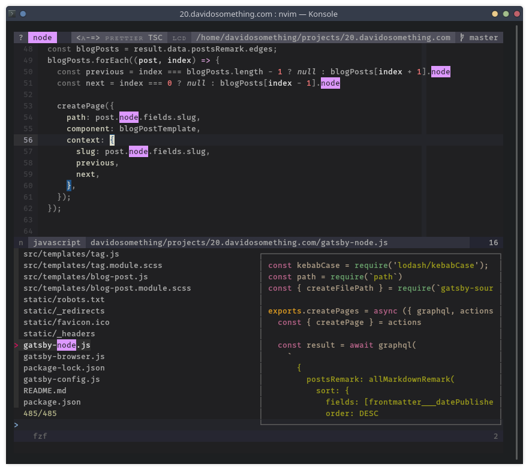

## Physical setup

My desk is a 48"x24" [Herman Miller Everywhere Rectangular Table]. I wish
I had gone with the white finish and legs for the table.

A giant [AUKEY mouse pad] covers the top, granting unlimited mouse travel, and
it's much nicer to have a soft surface than to place my wrists on the bare
desktop.

I sit on a limited edition [SOHO Premier Soft Pad Management Chair] in brown
Italian leather with a matte black aluminum frame. My previously chair was
a generic padded dining chair, but it broke and now I use the seat as a foot
rest.

I have a nice [Poppin file cabinet] that doubles as a second seat.

## Hardware

### Main computer

My primary computer is a [Mac Pro 5,1 2010]. I bought it in an office
liquidation auction in 2016. It's considered end-of-life by Apple, but with
third party support I'm able to continue using it.

I upgraded it with a wireless AC/bluetooth 4 card, 48GB of RAM, a [SAPPHIRE
PULSE RX580], and an NVMe boot drive along side several SSDs. I use [OpenCore
bootloader] for EFI bootscreen and native Catalina support.

For peripherals, I use

- A [31.5-inch wide LED light bar] clamped to my desk
- A 27-inch [Lenovo P27u-10] 4K IPS Monitor on a...
- [VIVO desk mount] clamped to my desk
- An [Apple Magic Keyboard] because I got used to the Apple scissor feel
- A [VicTsing gaming mouse] with silent click so as not to wake the baby
- [Sony MDR7506 headphones] that I never put on my head... I use them as
  terrible speakers even though they're highly praised studio headphones
- Some generic 7 port USB 3.0 powered hub
- A USB 3.0 Anker hard drive docking station to access my old HDDs
- A [Fujitsu ScanSnap S1300i] scanner because I scan everything important
- A [Canon PIXMA iP110 printer] which is really slim

Everything plugs in to a [Belkin 8-Outlet surge protector].

### Media computer

I use an [Intel NUC 7i5BNH] as a media computer, connected to my TV. It is
outfitted with

- 32GB RAM, which is just adequate these days
- A 500GB [Samsung 970 EVO NVMe] for the OS + /home
- A 500GB [Samsung 850 EVO SSD] for document storage
- A [Logitech K400 Plus] keyboard+trackpad

### Phone

I'm an Android user on a Pixel 4a.

My particular favorite apps are:

- [Flamingo for Twitter] though I don't think it's available any more
- [Sync Pro] for reddit
- [PocketCasts] briefly switched to [AntennaPod] but now back
- [Feedly Classic] you can't "mark page as read" with the same ease in the new
  version
- [Brave] blocks ads and is Chromium-based
- [Tachiyomi] for reading endless amounts of manhua and isekai trash.

### Audio

I use [Bose SoundSport Wireless Headphones]. I haven't gone full wireless
because I like having the neck wire to hang them from when I'm not wearing
them.

### Watch

White [Pebble Time] running [rebble] services. I've had two pebbles, both
Kickstarter backer editions. I still consider the Time the best smartwatch.

## Software

[My dotfiles], vimrc, zshrc, and [Chrome extensions] of choice are in GitHub
if that's what you're into.

CLI tools I use include:

- [fd] for finding files and directories
- [fzf] for fuzzy finding integrated with git, vim, and my shell
- [ripgrep] for finding and filtering files by contents
- [z.lua] a fast lua implementation if autojump / z
- [zinit] for managing my zsh plugins

On the mac I use Catalina. I use iTerm2 because I like its window splitting
features above all other terminal emulators.

On the NUC I use [Manjaro] Linux KDE version. Manjaro has the benefits of Arch
Linux (IMO, primarily pacman and the AUR) without having to do the setup for
the millionth time. And KDE Plasma is pretty. Konsole is my terminal emulator
because it is non-electron, supports splitting without tmux, 24-bit color,
customizable shortcuts and scrollback. It checks all the boxes for me.
Terminator and Termite are my other terminal choices. I am not using them
because they are libvte-based and I wanted to stay in the KDE world.

### Editor

I still use [Neovim] having moved from Vim years ago. I follow HEAD since
I prudent enough read the Gitter room and changelogs.

I made my own color scheme called "[meh]." It caters to what I consider
important when looking at code.

My programming font of choice is Mozilla's [Fira Mono].

### Notes

For note-taking, I converted to [Joplin Notes] last year. Joplin is
cross-platform including mobile apps; it has markdown support, tagging, and
end-to-end encrypted syncing. The desktop UI is a bit drab, but customizable
via CSS.

### Password manager

My password manager is [Bitwarden], and I pay for Premium. I moved from
[KeepassXC] to make sharing some passwords easier with my family.

### File sync and backups

I wouldn't be at a loss if I had re-provision with the same settings
and restore my files.

For file syncing and sharing I use Dropbox and Google Drive (e.g. my resume,
avatars, etc.). I always assume that things in those cloud services can go
public at any time. For super private stuff, I have a [Synology NAS] I can
access.

My cloud files and local photos and documents are synced to my NAS. I send
encrypted, incremental snapshots of the synced drive to [Backblaze B2] using
[restic] running in a Docker container.

A few of my GitHub and GitLab repos are mirrored to a local Dockerized [Gitea]
server in case either of those services go down or missing. [Watchtower] keeps
my Docker containers up-to-date automatically.

On the OS-level, I keep my `/etc` backed up using [etckeeper], and push to
a remote git repo as backup.

[31.5-inch wide LED light bar]: https://www.amazon.com/gp/product/B083XJLWND
[Intel NUC 7i5BNH]: https://www.intel.com/content/www/us/en/products/boards-kits/nuc/kits/nuc7i5bnh.html
[Lenovo P27u-10]: https://www.lenovo.com/us/en/accessories-and-monitors/monitors/professional/p27u-10-a16270up0-27-inch-monitor-hdmi-cd/p/61CBGAR1US
[VIVO desk mount]: https://www.amazon.com/gp/product/B00B21TLQU
[Samsung 970 EVO NVMe]: https://www.amazon.com/Samsung-970-EVO-500GB-MZ-V7E500BW/dp/B07BN4NJ2J
[Samsung 850 EVO SSD]: https://www.amazon.com/Samsung-2-5-Inch-Internal-MZ-75E500B-EU/dp/B00P73B1E4
[Fujitsu ScanSnap S1300i]: https://www.amazon.com/Fujitsu-ScanSnap-Portable-Document-Scanner/dp/B008HBFADQ
[Canon PIXMA iP110 printer]: https://www.usa.canon.com/internet/portal/us/home/products/details/printers/inkjet-single-function/ip-series/ip110
[Apple Magic Keyboard]: https://www.amazon.com/gp/product/B016QO64FI
[VicTsing gaming mouse]: https://www.amazon.com/gp/product/B075M3YY18
[Sony MDR7506 headphones]: https://www.amazon.com/gp/product/B000AJIF4E
[Bose SoundSport Wireless Headphones]: https://www.amazon.com/Bose-SoundSport-Wireless-Headphones-Black/dp/B01LZI7KQB
[AUKEY mouse pad]: https://www.amazon.com/gp/product/B00QM9KL5M
[Belkin 8-Outlet surge protector]: https://www.amazon.com/gp/product/B000HPV3RW
[Herman Miller Everywhere Rectangular Table]: https://store.hermanmiller.com/office/conference-tables/everywhere-rectangular-table/3383.html
[Manjaro]: https://manjaro.org/
[My dotfiles]: https://github.com/davidosomething/dotfiles
[Chrome extensions]: https://github.com/davidosomething/dotfiles/blob/dev/chromium/extensions.md
[meh]: https://github.com/davidosomething/vim-colors-meh
[Joplin Notes]: https://joplinapp.org/
[Bitwarden]: https://bitwarden.com/
[KeepassXC]: https://keepassxc.org/
[Fira Mono]: https://mozilla.github.io/Fira/
[restic]: https://restic.net/
[etckeeper]: https://joeyh.name/code/etckeeper/
[Poppin file cabinet]: https://www.poppin.com/White-%2B-Light-Gray-Mini-Stow-2-Drawer-File-Cabinet%2C-Rolling-104771+%3A+104732.html
[Neovim]: https://neovim.io
[Nova Launcher Prime]: https://play.google.com/store/apps/details?id=com.teslacoilsw.launcher.prime&hl=en_US
[Flamingo for Twitter]: https://play.google.com/store/apps/details?id=com.samruston.twitter
[Sync Pro]: https://play.google.com/store/apps/details?id=com.laurencedawson.reddit_sync.pro
[KDE Connect]: https://play.google.com/store/apps/details?id=org.kde.kdeconnect_tp
[AntennaPod]: https://play.google.com/store/apps/details?id=de.danoeh.antennapod
[PocketCasts]: https://play.google.com/store/apps/details?id=au.com.shiftyjelly.pocketcasts&hl=en_US
[Feedly Classic]: https://play.google.com/store/apps/details?id=com.devhd.feedly.classic
[Amazon Moto X4]: https://www.amazon.com/Moto-4th-Generation-hands-free-Exclusive/dp/B077YNYFPD
[rebble]: http://rebble.io/
[fzf]: https://github.com/junegunn/fzf
[fd]: https://github.com/sharkdp/fd
[ripgrep]: https://github.com/BurntSushi/ripgrep
[z.lua]: https://github.com/skywind3000/z.lua
[zinit]: https://github.com/zdharma/zinit
[Backblaze B2]: https://www.backblaze.com/
[Synology NAS]: https://www.synology.com/
[Gitea]: https://gitea.io/
[Watchtower]: https://containrrr.github.io/watchtower/
[Pebble Time]: https://www.kickstarter.com/projects/getpebble/pebble-time-awesome-smartwatch-no-compromises
[Brave]: https://play.google.com/store/apps/details?id=com.brave.browser
[Mac Pro 5,1 2010]: https://forums.macrumors.com/forums/mac-pro.1/
[SAPPHIRE PULSE RX580]: https://www.sapphiretech.com/en/consumer/pulse-rx-580-8g-g5
[OpenCore bootloader]: https://github.com/acidanthera/OpenCorePkg
[Logitech K400 Plus]: https://www.logitech.com/en-us/product/wireless-touch-keyboard-k400-plus
[Tachiyomi]: https://tachiyomi.org/
[SOHO Premier Soft Pad Management Chair]: https://www.lauradavidsondirect.com/products/soho-premier-soft-pad-management-chair-brown-leather-black-frame-limited-edition
