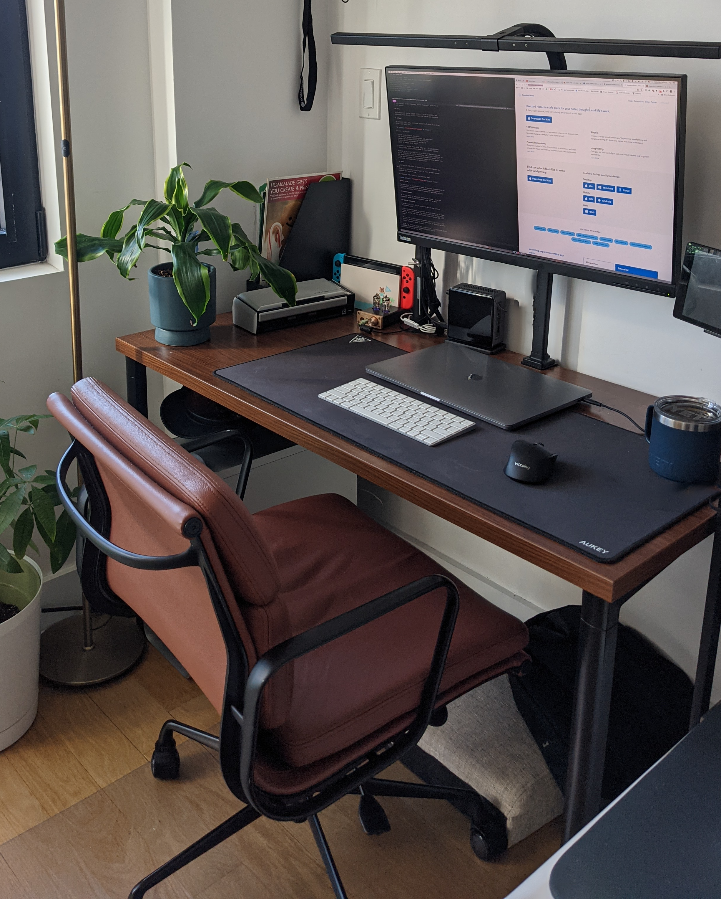
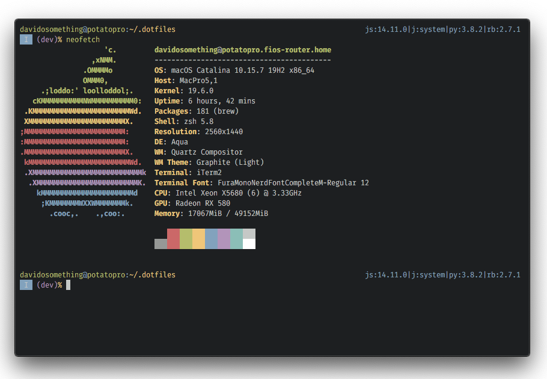
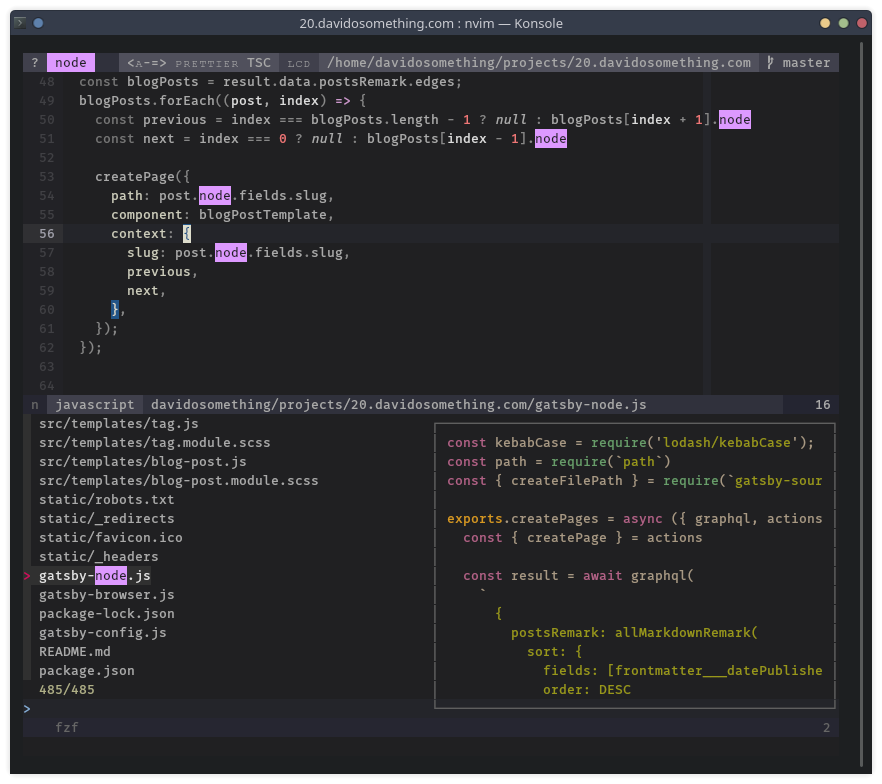

I keep this post updated throughout 2021.  
Some of the links below are affiliate links. This means that, at zero cost to
you, I may earn a commission if you click through the link and finalize
a purchase.

## Physical setup

I sit on a limited edition [SOHO Premier Soft Pad Management Chair] in brown
Italian leather with a matte black aluminum frame. My previously chair was
a generic padded dining chair, but it broke and now I use the seat as a foot
rest.

My desk is a 48"x24" [Herman Miller Everywhere Rectangular Table]. I wish
I had gone with the white finish and legs for the table.

A giant [AUKEY mouse pad] covers the top, granting unlimited mouse travel, and
it's much nicer to have a soft surface than to place my wrists on the bare
desktop.

In the corner of the desk is an [Amazon Basics Magazine Rack] to hold mail and
to-do paper items I eventually have to go through.

I have a nice [Poppin file cabinet] that doubles as a second seat.

## Hardware

### Main computer

My primary computer is a [Mac Pro 5,1 2010]. I bought it in an office
liquidation auction in 2016. It's considered end-of-life by Apple, but with
third party support through [OpenCore bootloader] I'm able to continue
updating it.

I upgraded it with a wireless AC/bluetooth 4 card, 48GB of RAM, a [SAPPHIRE
PULSE RX580], two [NVMe drives using PCI-E adapters] and several SSDs.

For peripherals, I use

- A [31.5-inch wide LED light bar] clamped to my desk
- A 27-inch [Lenovo P27u-10] 4K IPS Monitor with a built-in USB hub
- A [VIVO desk mount] holds the monitor
- An [Apple Magic Keyboard] because I got used to the Apple scissor feel
- A [VicTsing gaming mouse] silent click and USB rechargeable. I've used at
  least 5 other silent click mice from Amazon, and this one is so far the
  winner.
- A [Fujitsu ScanSnap S1300i] scanner because I scan everything important
- A [Canon PIXMA iP110 printer] which is really slim

Everything plugs in to a [Belkin 8-Outlet surge protector].

### Media computer

I use an [Intel NUC 7i5BNH] as a secondary computer. It is outfitted with

- An [ElecGear iNUC-H Vertical Stand] to take up less desk space
- 32GB RAM, which is just adequate these days
- A 500GB [Samsung 970 EVO NVMe] for the OS + /home
- A 500GB [Samsung 850 EVO SSD] for document storage
- A [Logitech K400 Plus] keyboard+trackpad

### Phone

I'm an Android user on a [Pixel 4a]. My particular favorite apps are:

- [Flamingo for Twitter] though I don't think it's available any more
- [Sync Pro] for reddit
- [PocketCasts] briefly switched to [AntennaPod] but now back
- [Feedly Classic] you can't "mark page as read" with the same ease in the new
  version
- [Brave] blocks ads and is Chromium-based
- [Tachiyomi] for reading endless amounts of manhua and isekai trash.

### Audio

On my main computer, I use [Sony MDR7506 headphones] that I never put on my
head. I use them as terrible speakers even though they're highly praised
studio headphones. They're connected to a [Nobsound NS-08E] preamp, which
I mostly use for the physical volume knob.

My going-out headphones are [Samsung Galaxy Buds+], paired only to my phone.

My work headphones are [Bose SoundSport Wireless Headphones], paired only to
my work computer.

### Watch

White [Pebble Time] running [rebble] services. I've had two pebbles, both
Kickstarter backer editions. I still consider the Time the best smartwatch.

## Software

[My dotfiles], vimrc, zshrc, and [Chrome extensions] of choice are in GitHub
if that's what you're into.

CLI tools I use include:

- [fd] for finding files and directories
- [fzf] for fuzzy finding integrated with git, vim, and my shell
- [ripgrep] for finding and filtering files by contents
- [zinit] for managing my zsh plugins
- [zoxide] a fast implementation of autojump / z

On the mac I use Catalina and am scared of Big Sur. I use iTerm2 because
I like its window splitting features above all other terminal emulators.

On the NUC and on a second boot drive on the mac I use [Manjaro] Linux KDE
version. Manjaro has the benefits of Arch Linux (IMO, primarily pacman and the
AUR) without having to do the setup for the millionth time. Konsole is my
terminal emulator because it is non-electron, supports splitting without tmux,
24-bit color, customizable shortcuts and scrollback.

### Editor

I still use the HEAD release of [Neovim] having moved from Vim years ago.

I made my own color scheme called "[meh]." It caters to what I consider
important when looking at code.

My programming font of choice is Mozilla's [Fira Mono].

### Note Taking

[Standard Notes] is my note-taking app for the moment. My criteria are full,
audited encryption, markdown support, and automatic syncing. I left
[Joplin Notes] because the WebDav sync was giving me issues (though it could
have been my server).

### Password manager

My password manager is [Bitwarden]. I moved off of [KeepassXC] to make it
easier on my family, but they are equally good to me.

### File sync and backups

I've done my best to stop using Dropbox, just so I have one less account to
manage. I use Google Drive for one-off document sharing and syncing app
settings on any app that natively supports it.

For everything else I use my [Synology NAS]. My phone automatically backs up
photos to it using DS File.

The NAS is running [Gitea] on Docker. I have my GitHub and GitLab repos are
mirrored in case either of those services go down or missing. On both my NUC
and Mac (when using Linux), I have `/etc` backed up using [etckeeper] and
pushing to a remote repo in Gitea.

Google Drive is synced to my NAS as well. Everything is backed up using
[restic], which send encrypted, incremental snapshots to [Backblaze B2].

[31.5-inch wide LED light bar]: https://amzn.to/3wcr83h
[Intel NUC 7i5BNH]: https://amzn.to/3afGKJQ
[ElecGear iNUC-H Vertical Stand]: https://amzn.to/3uXvvxo
[Lenovo P27u-10]: https://amzn.to/3toSJMO
[VIVO desk mount]: https://amzn.to/3rCPHTk
[Samsung 970 EVO NVMe]: https://amzn.to/3cwF6oE
[Samsung 850 EVO SSD]: https://amzn.to/2PiZa51
[Fujitsu ScanSnap S1300i]: https://amzn.to/39pD1c5
[Canon PIXMA iP110 printer]: https://www.usa.canon.com/internet/portal/us/home/products/details/printers/inkjet-single-function/ip-series/ip110
[Apple Magic Keyboard]: https://amzn.to/3fm30Fi
[VicTsing gaming mouse]: https://amzn.to/3sAWSwL
[Sony MDR7506 headphones]: https://amzn.to/3syEO6d
[Bose SoundSport Wireless Headphones]: https://amzn.to/2Rz6gDf
[Amazon Basics Magazine Rack]: https://amzn.to/3dlQtAg
[AUKEY mouse pad]: https://amzn.to/2Pb1NGi
[Belkin 8-Outlet surge protector]: https://amzn.to/3dlicje
[Herman Miller Everywhere Rectangular Table]: https://store.hermanmiller.com/office/conference-tables/everywhere-rectangular-table/3383.html
[Manjaro]: https://manjaro.org/
[My dotfiles]: https://github.com/davidosomething/dotfiles
[Chrome extensions]: https://github.com/davidosomething/dotfiles/blob/dev/chromium/extensions.md
[meh]: https://github.com/davidosomething/vim-colors-meh
[Joplin Notes]: https://joplinapp.org/
[Standard Notes]: https://standardnotes.org/
[Bitwarden]: https://bitwarden.com/
[KeepassXC]: https://keepassxc.org/
[Fira Mono]: https://mozilla.github.io/Fira/
[restic]: https://restic.net/
[etckeeper]: https://joeyh.name/code/etckeeper/
[Poppin file cabinet]: https://amzn.to/32ganpY
[Neovim]: https://neovim.io
[Pixel 4a]: https://amzn.to/3gkLeTv
[Nova Launcher Prime]: https://play.google.com/store/apps/details?id=com.teslacoilsw.launcher.prime&hl=en_US
[Flamingo for Twitter]: https://play.google.com/store/apps/details?id=com.samruston.twitter
[Sync Pro]: https://play.google.com/store/apps/details?id=com.laurencedawson.reddit_sync.pro
[KDE Connect]: https://play.google.com/store/apps/details?id=org.kde.kdeconnect_tp
[AntennaPod]: https://play.google.com/store/apps/details?id=de.danoeh.antennapod
[PocketCasts]: https://play.google.com/store/apps/details?id=au.com.shiftyjelly.pocketcasts&hl=en_US
[Feedly Classic]: https://play.google.com/store/apps/details?id=com.devhd.feedly.classic
[Amazon Moto X4]: https://amzn.to/31uqVdt
[rebble]: http://rebble.io/
[fzf]: https://github.com/junegunn/fzf
[fd]: https://github.com/sharkdp/fd
[ripgrep]: https://github.com/BurntSushi/ripgrep
[zinit]: https://github.com/zdharma/zinit
[zoxide]: https://github.coma/ajeetdsouza/zoxide
[Backblaze B2]: https://www.backblaze.com/
[Synology NAS]: https://www.synology.com/
[Gitea]: https://gitea.io/
[Watchtower]: https://containrrr.github.io/watchtower/
[Pebble Time]: https://www.kickstarter.com/projects/getpebble/pebble-time-awesome-smartwatch-no-compromises
[Brave]: https://play.google.com/store/apps/details?id=com.brave.browser
[Mac Pro 5,1 2010]: https://forums.macrumors.com/forums/mac-pro.1/
[SAPPHIRE PULSE RX580]: https://amzn.to/3af7lGY
[NVMe drives using PCI-E adapters]: https://amzn.to/3v0xCkp
[OpenCore bootloader]: https://github.com/acidanthera/OpenCorePkg
[Logitech K400 Plus]: https://www.logitech.com/en-us/product/wireless-touch-keyboard-k400-plus
[Tachiyomi]: https://tachiyomi.org/
[SOHO Premier Soft Pad Management Chair]: https://www.lauradavidsondirect.com/collections/soho-pad
[Samsung Galaxy Buds+]: https://amzn.to/31sbqmt
[Nobsound NS-08E]: https://amzn.to/2OajG7C
